<div align="center">


<br/>


### *What happens to a muon when it falls into a spinning black hole?*

[Overview](#-overview) •
[Physics](#-the-physics) •
[Architecture](#-architecture) •
[Requirements](#-project-requirements) •
[Structure](#-project-structure) •
[Quick Start](#-quick-start) •
[Milestones](#-milestones) •
[Validation](#-validation--testing) •
[References](#-references)

</div>

---

## 🌌 Overview

Game physics engines track objects in a flat, static coordinate system: subtract from `y` every frame and the character falls. The universe does not work that way. It runs on **General Relativity**, where space and time form a dynamic fabric that massive objects bend, and **spinning objects drag along with them like a spoon stirring honey**. This is **frame dragging** (the Lense–Thirring effect).

**Project Monograph** is a high-precision relativistic physics engine written in C++. It simulates a **cosmic-ray muon** plunging into a **Kerr (rotating) black hole** and tracks:

- 📍 **Where** the muon goes (its trajectory in the equatorial plane)
- ⏱️ **How fast it ages** (proper time τ versus the distant observer's coordinate time *t*)
- ☠️ **Where it dies** (the muon decays after 2.2 μs of *its own* proper time)
- 🔭 **How spin matters** (prograde versus retrograde versus non-rotating black holes)

### Key Features

| | Feature | Description |
|---|---|---|
| 🧮 | **RK4 geodesic integrator** | Fixed and adaptive step 4th-order Runge–Kutta in proper time |
| 🌀 | **Kerr equatorial geodesics** | Full Boyer–Lindquist implementation with spin parameter `a ∈ [0, 1)` |
| 🎯 | **ISCO finder** | Numerically locates the Innermost Stable Circular Orbit and checks it against Bardeen's closed form |
| 🧪 | **Conserved-quantity monitor** | Tracks drift in the radial constraint to measure numerical error |
| 📊 | **CSV data pipeline** | Every frame is exported for post-processing |
| 🎨 | **Matplotlib visualizations** | Trajectories colored by proper time, time-dilation curves, animated plunge GIFs |

---

## 🔬 The Physics

> You do **not** need tensor calculus to run this project. The geodesic equations are treated as a strict API: plug in state, get derivatives.

Units are geometric (**G = c = M = 1**), restricted to the **equatorial plane** (θ = π/2).

### Kerr Black Hole Parameters

| Symbol | Meaning |
|---|---|
| `a` | Spin parameter. `a = 0` is Schwarzschild (static), `a → 1` is near-extremal |
| `r₊ = 1 + √(1 − a²)` | Outer event horizon radius |
| `Δ = r² − 2r + a²` | Horizon function (zero at the horizon) |
| `E`, `L` | Specific energy and specific angular momentum (**conserved**) |
| `t` | Coordinate time (the distant observer's clock) |
| `τ` | Proper time (the muon's own clock) |

### Concept 1: Frame Dragging

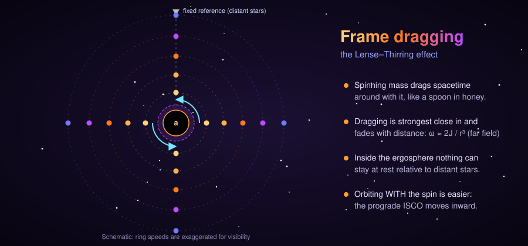

A spinning black hole twists the spacetime around it. Everything close in, including light and matter, is swept around in the direction of the spin. Far from the hole the effect fades quickly, roughly as `1/r³`.

### Concept 2: Prograde versus Retrograde ISCO

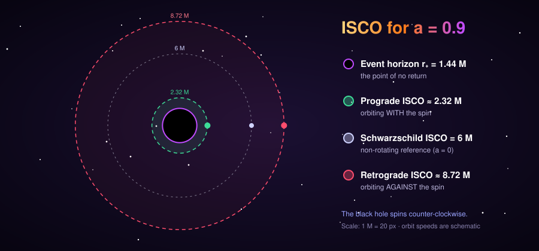

Because spacetime is flowing with the spin, an orbit that goes **with** the flow can stay stable much closer to the hole than one fighting **against** it. For `a = 0.9` the prograde ISCO sits at about 2.32 M and the retrograde ISCO at about 8.72 M. **Phase 1 of this project reproduces exactly this result numerically.**

### Equations of Motion

$$\frac{dt}{d\tau} = \frac{\left(r^2 + a^2 + \frac{2a^2}{r}\right)E - \frac{2a}{r}L}{\Delta}$$

$$\frac{d\phi}{d\tau} = \frac{\left(1 - \frac{2}{r}\right)L + \frac{2a}{r}E}{\Delta}$$

$$\frac{d^2 r}{d\tau^2} = -\frac{1}{r^2} - \frac{K}{r^3} - \frac{3J}{r^4}, \qquad K = a^2(E^2 - 1) - L^2,\quad J = (L - aE)^2$$

### Built-in Error Check

The radial equation is the derivative of the first integral

$$\left(\frac{dr}{d\tau}\right)^2 = E^2 - 1 + \frac{2}{r} + \frac{K}{r^2} + \frac{2J}{r^3}$$

The engine monitors the difference between the left and right sides at every step. If RK4 is working, this stays near machine precision.

### Concept 3: Time Dilation Near the Horizon

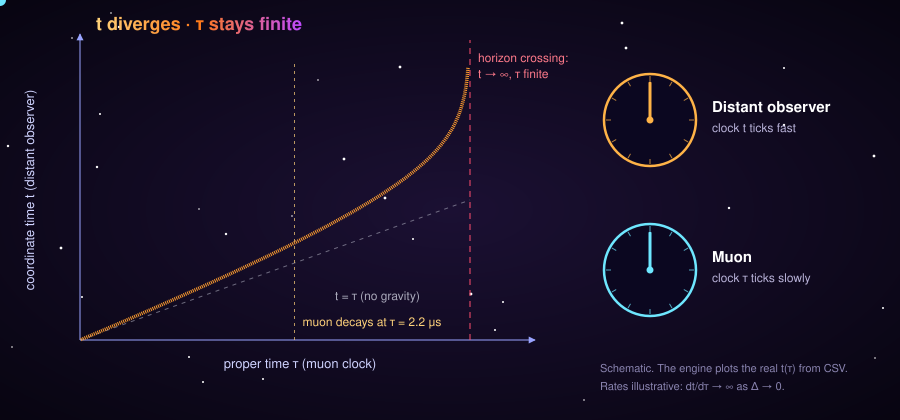

In Boyer–Lindquist coordinates, `dt/dτ → ∞` as `Δ → 0`. A distant observer never sees the muon cross the horizon, while the muon's own proper time stays **finite**. The muon still decays after 2.2 μs of its own time; what changes is **where** that happens and how much coordinate time passes for the observer. The engine plots this divergence from real data.

### Mass Scale

One geometric unit of time is `GM/c³ ≈ 4.925 μs` per solar mass.

| Black hole mass | 1 M in time | Muon lifetime (2.2 μs) in units of M |
|---|---|---|
| 10 M☉ | ≈ 49.25 μs | ≈ 0.045 M |
| 10⁶ M☉ | ≈ 4.925 s | ≈ 4.5 × 10⁻⁷ M |

The unit conversion is explicit in the code (`units.hpp`), so you can run any mass.

> **Why the default mass is 0.1 M☉:** a plunge takes roughly 6 to 30 M of proper time, but around a 10 M☉ hole the muon's whole life is only 0.045 M, so it decays right at launch. A hypothetical 0.1 M☉ black hole puts the decay in the middle of the plunge, which is where the physics is interesting. The program tells you when your chosen mass makes the muon die at launch.

---

## 🏗️ Architecture

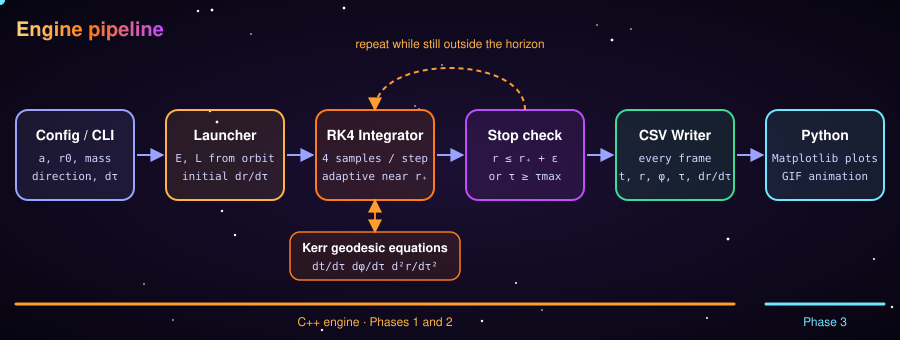

<details>
<summary><b>Static version of the flowchart (Mermaid)</b></summary>

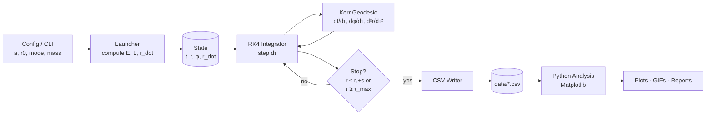

</details>

### The State Vector

Because the radial equation is second order, RK4 needs the radial velocity as part of the state. Proper time τ is the **independent variable** (the integration clock) and is accumulated alongside the state.

```cpp
struct State {
    double t;      // coordinate time
    double r;      // Boyer–Lindquist radius
    double phi;    // azimuthal angle
    double r_dot;  // dr/dτ
};
// τ is the loop variable: while (tau < tau_max && r > r_plus + eps) { ... }
```

### Constants of Motion

Computed once at launch, then passed as `const` into every update step:

```cpp
struct Constants { double a, E, L; };
```

### The RK4 Step


Each tick of proper time `dτ` samples the derivatives four times (at the start, twice at the midpoint, and at the end) and blends them with weights 1-2-2-1. That blend is what gives RK4 its accuracy: halving `dτ` shrinks the error by about 16×.

```
k1 = f(τ,        y)
k2 = f(τ + dτ/2, y + dτ/2 · k1)
k3 = f(τ + dτ/2, y + dτ/2 · k2)
k4 = f(τ + dτ,   y + dτ   · k3)
y_next = y + dτ/6 · (k1 + 2·k2 + 2·k3 + k4)
```

---

## 📋 Project Requirements

### Functional Requirements

| ID | Requirement | Phase |
|---|---|---|
| **FR-1** | Implement Kerr equatorial geodesic derivatives (`dt/dτ`, `dφ/dτ`, `d²r/dτ²`) | 1 |
| **FR-2** | Implement a generic 4th-order Runge–Kutta integrator | 1 |
| **FR-3** | Compute circular-orbit `E` and `L` for any `r` and spin `a` (prograde and retrograde) | 1 |
| **FR-4** | Numerically locate the ISCO for prograde and retrograde orbits | 1 |
| **FR-5** | Show that the prograde ISCO lies inside the retrograde ISCO for `a > 0` | 1 |
| **FR-6** | Launch a muon on a decaying (plunging) trajectory | 2 |
| **FR-7** | Write the full state to CSV at every frame | 2 |
| **FR-8** | Track `t` versus `τ` divergence until the horizon cutoff `r₊ + ε` | 2 |
| **FR-9** | Mark the point where `τ = 2.2 μs` (muon decay) in the output | 2 |
| **FR-10** | Plot the orbital path with a proper-time color gradient | 3 |
| **FR-11** | Compare `a = 0`, prograde, and retrograde decay locations | 3 |

### Non-Functional Requirements

| ID | Requirement |
|---|---|
| **NFR-1** | Double precision throughout; constraint drift below `1e-8` for validation runs |
| **NFR-2** | Adaptive step size near the horizon where `Δ → 0` |
| **NFR-3** | Deterministic, reproducible runs from a single config |
| **NFR-4** | Unit tests for every physics function, run via CTest |
| **NFR-5** | Clean separation of physics, numerics, I/O, and visualization |
| **NFR-6** | Builds on Linux, macOS, and Windows (CMake) |

### Software Requirements

| Tool | Version |
|---|---|
| C++ compiler | GCC 9+, Clang 10+, or MSVC 2019+ (C++17) |
| CMake | 3.16+ |
| Python | 3.10+ |
| Python packages | `numpy`, `pandas`, `matplotlib`, `pillow` (for GIFs) |
| Optional | `ffmpeg` (MP4 export), `doxygen` (API docs) |

---

## 📁 Project Structure

```
project-monograph/
│
├── 📄 README.md
├── 📄 LICENSE
├── 📄 CMakeLists.txt             # Top-level build file
├── 📄 requirements.txt           # Python dependencies
├── 📄 .gitignore
│
├── 📂 assets/                    # README images and animations
│   ├── banner.svg
│   ├── frame_dragging.svg
│   ├── isco_orbits.svg
│   ├── time_dilation.svg
│   ├── pipeline.svg
│   ├── rk4_step.svg
│   ├── phases.svg
│   ├── plunge.gif                # Generated by python/animate_plunge.py
│   ├── trajectory.png            # Generated by python/plot_trajectory.py
│   ├── time_dilation.png         # Generated by python/plot_time_dilation.py
│   ├── compare_spins.png         # Generated by python/compare_spins.py
│   └── isco_survival.png         # Generated by python/plot_isco.py
│
├── 📂 include/monograph/         # Public C++ headers
│   ├── state.hpp                 # State and Constants structs
│   ├── units.hpp                 # Geometric ↔ SI conversions (μs, km, M☉)
│   ├── kerr.hpp                  # Geodesic derivatives, horizon, constraint
│   ├── rk4.hpp                   # Integrator (fixed and adaptive step)
│   ├── orbits.hpp                # Circular-orbit E, L; ISCO formulas
│   └── csv_writer.hpp            # Buffered CSV output
│
├── 📂 src/                       # C++ implementation
│   ├── kerr.cpp
│   ├── rk4.cpp
│   ├── orbits.cpp
│   ├── csv_writer.cpp
│   ├── main_isco.cpp             # Phase 1 executable: ISCO scan
│   └── main_plunge.cpp           # Phase 2 executable: muon plunge
│
├── 📂 tests/                     # CTest unit tests
│   ├── test_kerr.cpp             # Known-value checks of the derivatives
│   ├── test_rk4.cpp              # Integrator on a harmonic oscillator
│   ├── test_isco.cpp             # ISCO versus Bardeen's formula
│   └── test_constraint.cpp       # Radial constraint drift over a run
│
├── 📂 python/                    # Phase 3 analysis and visualization
│   ├── plot_isco.py              # Survival map, prograde versus retrograde
│   ├── plot_trajectory.py        # Path colored by proper time
│   ├── plot_time_dilation.py     # t(τ) divergence curve
│   ├── compare_spins.py          # a = 0 versus prograde versus retrograde
│   └── animate_plunge.py         # Produces assets/plunge.gif
│
├── 📂 configs/                   # Run configurations
│   ├── isco_scan.cfg
│   ├── plunge_prograde.cfg
│   ├── plunge_retrograde.cfg
│   └── plunge_schwarzschild.cfg
│
├── 📂 data/                      # CSV output (created on first run, git-ignored)
│
├── 📂 docs/
│   ├── physics_notes.md          # Derivations and equation reference
│   ├── rk4_primer.md             # RK4 for second-order ODEs
│   └── validation_report.md      # Results versus analytic targets
│
└── 📂 scripts/
    ├── build.sh
    ├── run_all.sh                # Build → ISCO → plunge → plots
    └── clean.sh
```

---

## 🚀 Quick Start

### 1. Clone

```bash
git clone https://github.com/<your-username>/project-monograph.git
cd project-monograph
```

### 2. Build the C++ engine

```bash
cmake -S . -B build -DCMAKE_BUILD_TYPE=Release
cmake --build build -j
ctest --test-dir build --output-on-failure
```

### 3. Install Python dependencies

```bash
python -m venv .venv
source .venv/bin/activate        # Windows: .venv\Scripts\activate
pip install -r requirements.txt
```

### 4. Run the pipeline

```bash
mkdir -p data

# Phase 1: find the ISCO and sweep which orbits survive (a = 0.9)
./build/monograph_isco --spin 0.9 --out data/isco_scan.csv

# Phase 2: the muon plunge, three cases (default black hole mass: 0.1 solar masses)
./build/monograph_plunge --spin 0   --out data/schwarzschild.csv
./build/monograph_plunge --spin 0.9 --direction prograde   --out data/prograde.csv
./build/monograph_plunge --spin 0.9 --direction retrograde --out data/retrograde.csv

# Phase 3: figures
python python/plot_isco.py data/isco_scan.csv --spin 0.9 --out assets/isco_survival.png
python python/plot_trajectory.py data/prograde.csv --out assets/trajectory.png
python python/plot_time_dilation.py data/prograde.csv --spin 0.9 --out assets/time_dilation.png
python python/compare_spins.py data/schwarzschild.csv data/prograde.csv data/retrograde.csv \
    --labels "a = 0" "a = 0.9 prograde" "a = 0.9 retrograde" --out assets/compare_spins.png
python python/animate_plunge.py data/prograde.csv --out assets/plunge.gif
```

Or run everything:

```bash
bash scripts/run_all.sh
```

### CLI Reference

| Flag | Meaning | Default |
|---|---|---|
| `--spin` | Black hole spin `a` (0 ≤ a < 1) | `0.9` |
| `--direction` | `prograde` or `retrograde` | `prograde` |
| `--r0` | Launch radius in units of M | `6.0` |
| `--lfrac` | Fraction by which the circular-orbit angular momentum is reduced (bigger = steeper plunge) | `0.3` |
| `--mass` | Black hole mass in M☉ (sets the μs scale and the decay point) | `0.1` |
| `--dtau` | Largest proper-time step, in M | `0.002` |
| `--eps` | Stop at `r₊ + eps` | `1e-6` |
| `--taumax` | Give up after this much proper time (M) | `5000` |
| `--out` | Output CSV path | `plunge.csv` |

### Output Format

```
tau, t, r, phi, r_dot, x, y, dt_dtau, constraint_error, muon_alive, tau_us, t_us
```

`tau`, `t` and `r` are in units of M; `tau_us` and `t_us` convert the two clocks to microseconds for the chosen `--mass`; `muon_alive` is `1` until the muon's 2.2 μs are used up.

---

## 🎯 Milestones

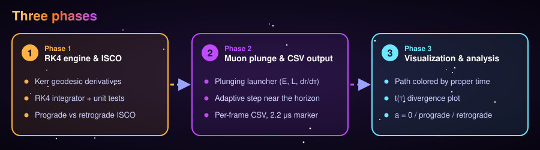

### Phase 1: The RK4 Engine and the ISCO
- [x] Implement Kerr equatorial derivatives
- [x] Implement RK4 and verify it on a known ODE
- [x] Analytic circular-orbit `E` and `L`
- [x] Radius sweep for prograde and retrograde stability
- [x] Reproduce the ISCO table below

**Deliverable:** a plot showing the prograde ISCO well inside the retrograde ISCO.

### Phase 2: The Muon Plunge and Data Output
- [x] Plunge launcher (circular `E`, `L`, then reduce `L` slightly)
- [x] Adaptive step size near the horizon
- [x] Per-frame CSV export
- [x] Flag the 2.2 μs decay event
- [x] Stop at `r₊ + ε`

**Deliverable:** `.csv` files for `a = 0`, prograde, and retrograde plunges.

### Phase 3: Visualization and Analysis
- [x] Trajectory plot colored by proper time
- [x] `t(τ)` divergence plot
- [x] Decay-location comparison across spins
- [x] Animated plunge GIF

**Deliverable:** the figures and `docs/validation_report.md`.

> All three phases are complete. The measured results are in [`docs/validation_report.md`](docs/validation_report.md).

---

## 🧪 Validation & Testing

### ISCO Targets (the engine must reproduce these)

| Spin `a` | Prograde ISCO | Retrograde ISCO |
|---|---|---|
| 0 | 6 M | 6 M |
| 0.9 | ≈ 2.32 M | ≈ 8.72 M |
| 0.998 | ≈ 1.24 M | ≈ 8.99 M |
| → 1 | 1 M | 9 M |

Ground truth is Bardeen's closed-form expression:

$$r_{\rm ISCO} = 3 + Z_2 \mp \sqrt{(3 - Z_1)(3 + Z_1 + 2Z_2)}$$

with

$$Z_1 = 1 + (1-a^2)^{1/3}\left[(1+a)^{1/3} + (1-a)^{1/3}\right], \qquad Z_2 = \sqrt{3a^2 + Z_1^2}$$

(upper sign: prograde, lower sign: retrograde).

### Test Suite

| Test | What it proves |
|---|---|
| `test_kerr` | Derivatives match hand-computed values at known points |
| `test_rk4` | Integrator converges at 4th order (halving `dτ` cuts error ~16×) |
| `test_isco` | Numerical ISCO matches Bardeen within the sweep resolution |
| `test_constraint` | `(dr/dτ)²` stays consistent with the first integral across a full plunge |

### Sanity Checks for Results

- With `a = 0`, prograde and retrograde runs must be identical.
- `t` must grow without bound as `r → r₊`, while `τ` stays finite.
- Circular orbits launched at `r > r_ISCO` must stay circular to tolerance.

---

## 📈 Results

Every figure below is produced by this repository: the C++ engine writes the CSV files, and the `python/` scripts turn them into pictures. Full numbers are in [`docs/validation_report.md`](docs/validation_report.md).

<div align="center">
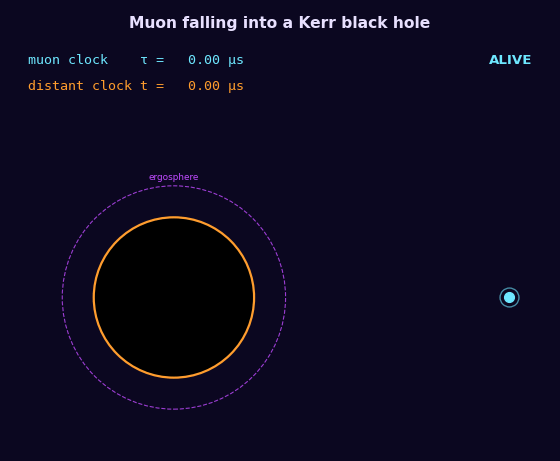

*The muon's clock and the distant observer's clock drift apart as it falls.*
</div>

### Frame dragging changes where the muon dies

The muon always lives 2.2 μs of its own time, but the point on its path where that happens depends on the black hole's spin and on whether the muon moves with it or against it. Same launch point, same 30% cut in angular momentum, black hole of 0.1 M☉:

| | a = 0 | a = 0.9 prograde | a = 0.9 retrograde |
|---|---|---|---|
| Muon clock at the horizon | 4.22 μs | 5.99 μs | 3.32 μs |
| Distant clock at the horizon | 21.15 μs | 33.02 μs | 29.05 μs |
| Angle swept | 0.23 turns | 2.67 turns | 1.97 turns |
| Radius where the muon decays | 4.32 M | 4.55 M | 3.81 M |
| Share of the plunge completed at decay | 52% | 37% | 66% |

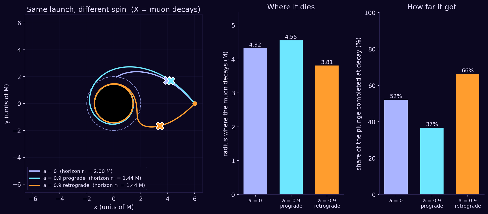

### The path, colored by proper time

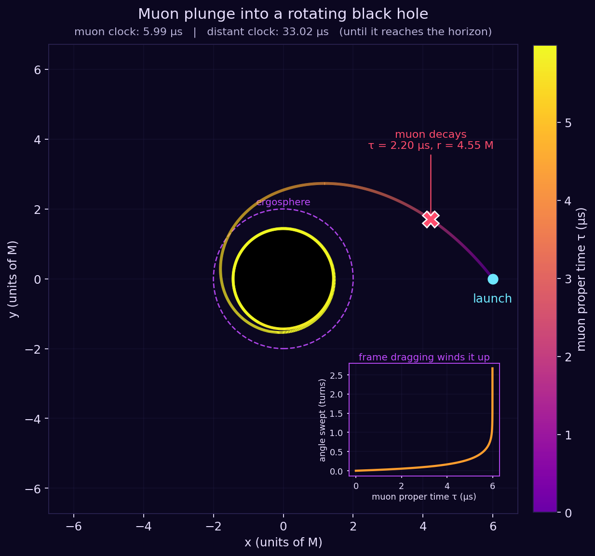

### Coordinate time diverges while proper time stays finite

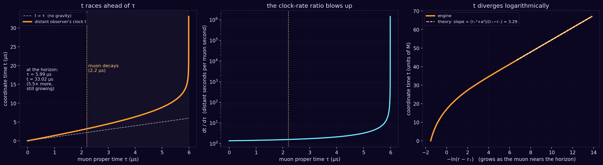

The right-hand panel is a check on the physics: near the horizon `t` must grow like `−(r₊²+a²)/(r₊−r₋) · ln(r−r₊)`, and the engine's curve lies on that straight line.

### Prograde orbits survive closer in

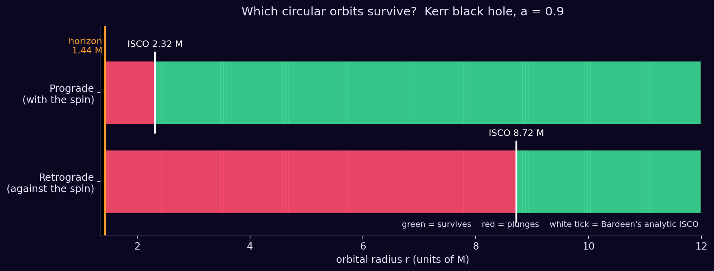

**The central result:** frame dragging does not change the muon's lifetime. It changes **where** along its path that lifetime runs out, and how much **coordinate time** a distant observer records for it.

---

## 🗺️ Roadmap

- [ ] Ingoing Kerr (Kerr–Schild) coordinates to cross the horizon smoothly
- [ ] Adaptive RK45 (Dormand–Prince) comparison
- [ ] Symplectic integrator comparison
- [ ] Off-equatorial (3D) geodesics via the Carter constant
- [ ] Real-time OpenGL viewer

---

## 📚 References

1. Bardeen, J. M., Press, W. H., Teukolsky, S. A. (1972). *Rotating Black Holes: Locally Nonrotating Frames, Energy Extraction, and Scalar Synchrotron Radiation.* ApJ 178, 347.
2. Misner, C. W., Thorne, K. S., Wheeler, J. A. *Gravitation.* (Ch. 33: Kerr geometry)
3. Press, W. H. et al. *Numerical Recipes.* (Runge–Kutta methods)
4. Chandrasekhar, S. *The Mathematical Theory of Black Holes.*
5. Hartle, J. B. *Gravity: An Introduction to Einstein's General Relativity.*

---

## 🤝 Contributing

1. Fork the repository
2. Create a feature branch: `git checkout -b feature/amazing-idea`
3. Add tests for new physics or numerics
4. Open a pull request

---

## 📜 License

Released under the **MIT License**. See [`LICENSE`](LICENSE).

---

<div align="center">

**Built with C++, Python, and a healthy respect for the curvature of spacetime.** 🌀

*"Spacetime tells matter how to move; matter tells spacetime how to curve."* (J. A. Wheeler)

⭐ Star this repo if it helped you understand frame dragging.

</div>